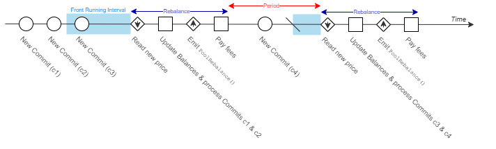
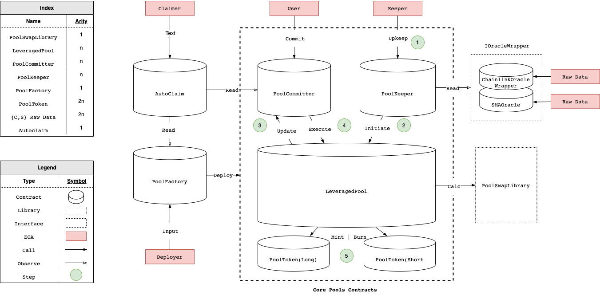

# Mechanism

## General

> Perpetual Pools is a bilateral derivative contract with transferrable positions. It uses the following general structure:   &#x20;

### Tokens

**Long** and **short** tokens are shares. They represent ownership of funds in a Perpetual Pool Market. Users can get tokens by adding funds to the Market or relinquish tokens to get funds back from the Market. &#x20;

### Pools&#x20;

Pools keep an account of funds that belong to long and short token holders, who are counterparties engaged in a perpetual transaction. The transaction involves a periodic transfer of funds from one pool to the other, based on the price performance of an underlying asset. By this definition, Pools enforce a derivative contract.&#x20;

### Contract

The contract specifies that a party transfers a percentage of their funds if the underlying asset's price moves against them.&#x20;


Perpetual Pools V2 use a [sigmoid ](./#leverage)function to calculate this percentage.


An adverse price movement for long tokens is a negative change (%) since the beginning of the period and for short tokens a positive change (%).&#x20;

The counterparty takes payment at the end of a period (at Rebalance), after which users are free to enter and exit the contract. &#x20;

## V2

> Tracer's V2 Perpetual Pools use the following specifications to support **leveraged** tokens:

### Leverage

The percentage of funds to transfer, $$t$$, is calculated using a **sigmoid** function, defined as:&#x20;

$$
f(t) = \begin{cases}\frac{2}{1+\exp(-2L(1-\frac{P_0}{P_1}))}-1,&P_1>P_0\\\frac{2}{1+\exp(-2L(1-\frac{P_1}{P_0}))}-1,&P_0>P_1\end{cases}
$$

where $$P_0$$ is the price of the underlying asset at the beginning of the period, $$P_1$$is the price at the end of the period, and $$L$$ is the leverage multiplier. It can be visualised (in red), compared to linear leverage (in blue):


For L=3. Follow the link (bottom right) to adjust the leverage multiplier and compare the functions.&#x20;


This function protects parties from bankruptcy in the event of anomalous hourly price movements as $$f(t)$$ is asymptotic to 1. We call the observed difference between linear and logarithmic returns PnL compression.&#x20;


The sigmoid transfer function is new for V2! Previously, Perpetual Pools used the "power leverage" transfer function.&#x20;


The transfer amount, $$T$$, is then:

$$
T=tf
$$

where $$f$$ is total funds belonging to transferring party.

### Transfer

Funds are transferred at the end of every period at which time the Pool updates its internal account to reflect the payment made by a party to their counterparty. This event is known as the Rebalance.

### Entry and Exit

Users can enter (_mint_) or exit (_burn_) (or switch (_flip_) their position in) a Pool immediately after the transfer. To be eligible for a given period, they must commit to the action before the [front-running interval](./#mint-and-burn) begins. &#x20;

## Implementation

> Production V2 Pools contracts are encoded in Solidity programming language and enforced by the Ethereum blockchain. They use the following architecture to operate: &#x20;

### Pricing

The underlying asset's price is reported by an oracle at the end of a period. This response passes through a 'wrapper' so it can be used as a valid input by the leverage function.&#x20;

#### SMA Pricing

The default SMA pricing scheme is an 8-period simple moving average (SMA). The wrapper stores the previous seven period's prices to add to the new response. The average of their sum is given as $$P_1$$.&#x20;


Pricing has changed from V1. Read the justification for this change on [Radar](https://tracer.finance/radar/v2-simulations/). Note that, with permission-less deployment, it is still possible to replicate the V1 contract specs.


### Keeper&#x20;

The transfer is initiated by a _keeper_ at the end of a period. For details, see the [Upkeep](../upkeep-and-autoclaim.md) section.&#x20;

### Mint and Burn

A Pool 'mints' new tokens when a user enters and 'burns' existing tokens when they exit. It does this based on the commitments made by users prior to a period's front-running interval. This interval prevents users from taking advantage of the [Pricing](./#pricing).


The front-running interval has changed from V1. Note that, with permission-less deployment, it is still possible to replicate the V1 contract specs.


### Commits

Users commit to **mint** (enter), **burn** (exit), or **flip** a position in the Pool by adding funds or relinquishing tokens.&#x20;

The Pool keeps an account of the funds parties commit to add at the end of the period. After the transfer, long and short tokens are 'batch' minted and the funds are added to the Pool. &#x20;

Likewise, the Pool keeps an account of the tokens each party commits to relinquish at the end of the period. After the transfer, long and short tokens are burned and funds are returned from the Pool.&#x20;

In the case where a user commits to flip their position, the Pool keeps account first of the funds to be returned after the tokens are burned and then of the tokens to receive after the funds are added.&#x20;


There is no minimum commit size in V2.&#x20;


### Escrow

Pools mint long and short tokens, and return funds, to an escrow account. Users can claim their assets, or enter and exit Pools, from escrow.

### Token Value

Share (token) value is determined by the ratio of a party's total outstanding tokens to total Pool funds. This ratio is updated at the transfer.&#x20;

For new Pools, tokens are minted at a ratio of 1:1. &#x20;
