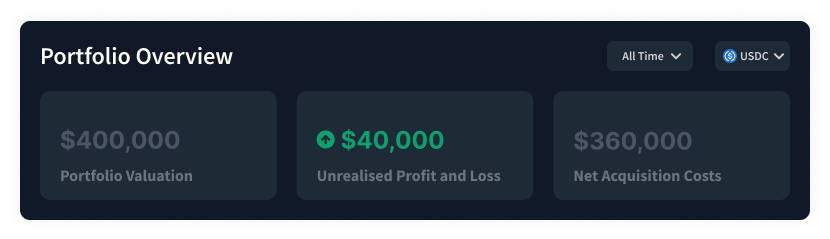
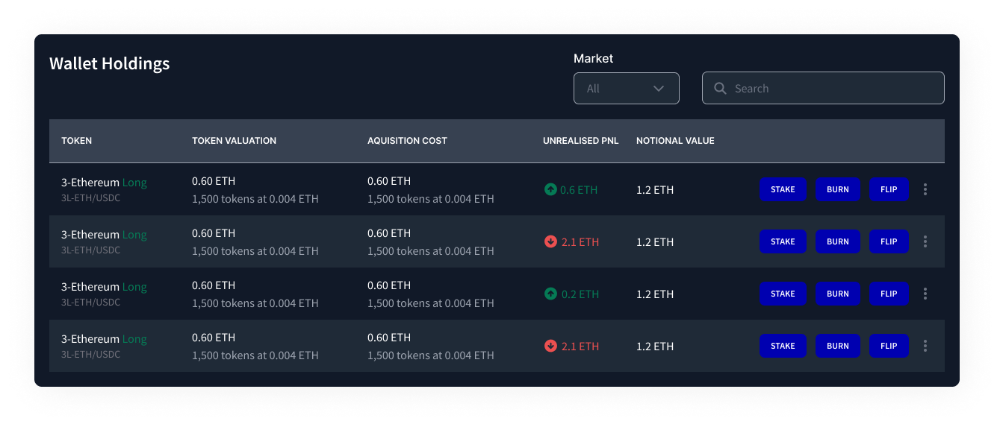

# 5. The Portfolio Page

There's a bit going on under the Portfolio tab. Let's take some time to go over the essentials. When you arrive, you'll see the total value of _all_ your tokens: &#x20;

This window also shows your net profit and loss, which just means how much money you made or lost from when you got your tokens until now. It also shows the fees you've paid to the protocol.

Next up, we've got the summary of the Pools tokens in your wallet:

It gives you a more detailed breakdown of each type of token you have and how much of it you hold. You can also do things from this window, like [stake your tokens](6.-staking-rewards.md), [burn them](broken-reference), or flip them from one side of the pool to the other.&#x20;

The last window is your assets in escrow. This shows any tokens that you've made but haven't claimed yet, or funds you've received by burning Pools tokens. Your tokens will appear here once they are minted.

.png>)

One more important thing to note is the pending commits button at the top of the page:

By clicking it, you can see the orders you've committed and the tokens waiting to mint or burn. This tab will also tell you how long is left until you can claim any funds or tokens.&#x20;
